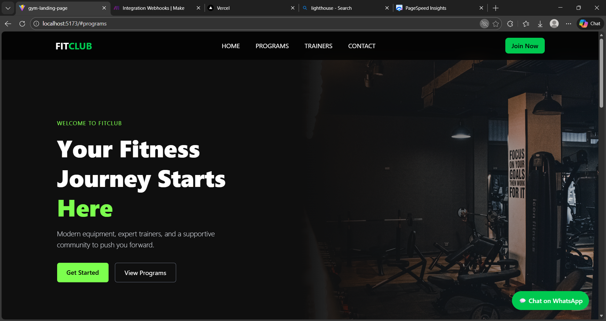
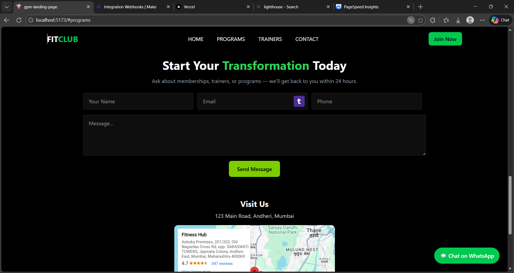
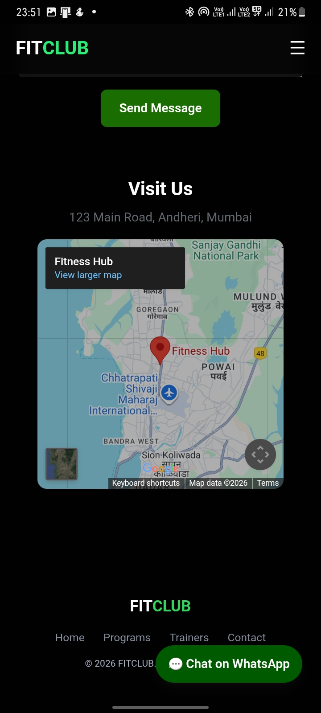

# FitClub — Modern Fitness Landing Page

A responsive, fast, and conversion-focused landing page template built for fitness clubs, gyms, and personal trainers.

## Features

- Responsive UI (Mobile, Tablet, Desktop)
- Conversion-focused CTA buttons
- Integrated Contact Form
- Google Sheets + Email Automation (Make.com)
- WhatsApp Chat CTA Support
- High-performance Hero Banner & Sections
- Deployed on Vercel

## Tech Stack

- React + Vite
- Tailwind CSS
- Make.com (Webhooks + Sheets + Gmail)
- Vercel (Deployment)

## Getting Started

1. Clone the repo:
```bash
git clone https://github.com/your-username/fitclub-landing.git
cd fitclub-landing
npm install 
```
2. create .env file
VITE_WHATSAPP_NUMBER=xxxxxxxxxx
VITE_WEBHOOK_URL=https://hooks.make.com/xxxxxxx

3. Run the project folder
npm run dev

## Integrations


| Make.com Webhooks | Form → Data Capture 
| Google Sheets     | Lead Logging        
| Gmail             | Lead Notifications  
| WhatsApp CTA      | Direct Messaging    


## Automation Pipeline

Landing Page → Webhook → Sheets → Gmail → (Optional WhatsApp)

## Screenshots



Mobile view


## License
This project is licensed under the MIT License — see LICENSE for more info